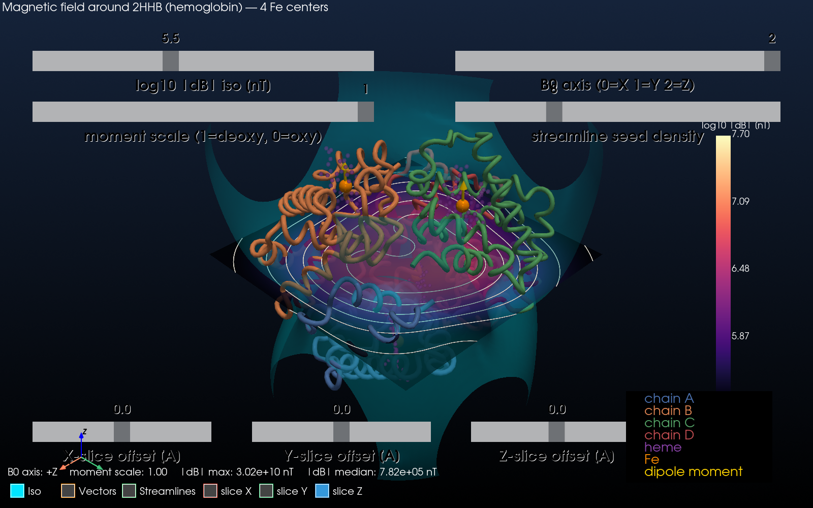
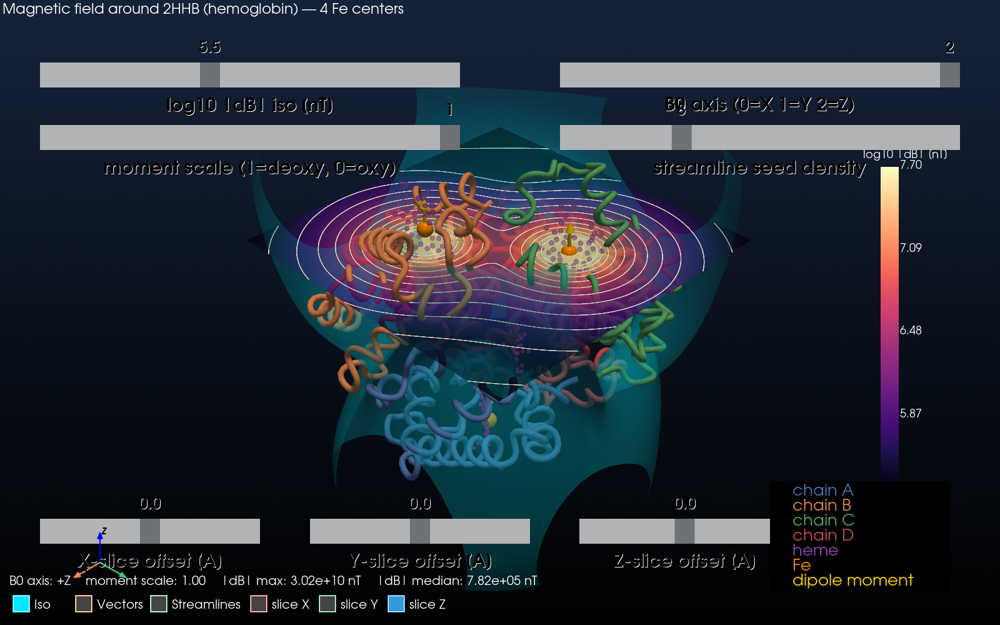
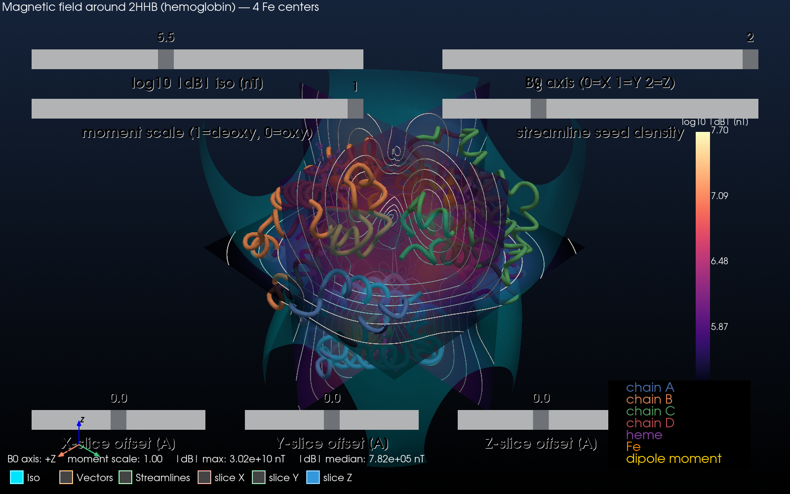

# Magnetic Field Around Hemoglobin — 3D Interactive Simulator

A scientifically grounded simulation and visualization of the magnetic field
produced by the four paramagnetic iron centers in **hemoglobin**
(default structure: PDB **2HHB**, human deoxyhemoglobin at 1.74 Å).

This is the same physics that underlies **BOLD contrast in functional MRI**:
deoxyhemoglobin's Fe(II) is high-spin (S = 2, ~5.4 μB per Fe) and
paramagnetic, so it perturbs an external B₀ field. Oxyhemoglobin is
low-spin and effectively diamagnetic. The fMRI signal you've seen in
neuroscience papers tracks exactly the field perturbation we visualize here.



*Default view: cyan **isosurface** of |ΔB|, magma-colored **Z-slice** with white **contour lines** of log₁₀ |ΔB|, and the four hemoglobin chains as colored ribbons. Each orange Fe carries a yellow induced-dipole arrow.*

<details>
<summary><b>More views</b> (click to expand)</summary>



*Z-slice scanned to **+15 Å above the heme plane** using the bottom-right slider — concentric circular contour rings appear around each Fe atom, the canonical 1/r³ magnetic dipole far-field signature.*



*All three orthogonal contour planes turned on at the protein center — closed dipolar contour loops on each cross-section.*

</details>

## What the simulator does

1. Downloads the chosen PDB file from RCSB (cached in `data/`).
2. Extracts the iron atoms, the four heme groups, and the C‑α backbone
   per chain (α1, α2, β1, β2).
3. Treats each Fe as a point magnetic dipole aligned with a user-chosen
   external field **B₀**. Each dipole carries a moment of
   `moment_scale × 5.4 μB` (1.0 = pure deoxy, 0.0 = pure oxy).
4. Computes the total dipolar field

   $$ \Delta \mathbf{B}(\mathbf{r}) = \frac{\mu_0}{4\pi}\sum_i
      \frac{3(\mathbf{m}_i\cdot\hat{\mathbf{r}}_i)\hat{\mathbf{r}}_i - \mathbf{m}_i}{r_i^3} $$

   on a regular 3D grid surrounding the protein.
5. Renders the result interactively with PyVista: the protein as a
   colored ribbon, the heme groups, the Fe atoms with dipole arrows, and
   the field as a combination of **isosurface**, **streamlines**,
   **vector glyphs**, and **three independent cross-section contour
   plots** (one per X / Y / Z axis, each scannable along its normal).

## Install

```bash
python3 -m venv .venv
source .venv/bin/activate
pip install -r requirements.txt
```

## Run

```bash
python run.py
```

On first launch the PDB file is downloaded automatically (≈530 kB) and
cached in `data/`.

### CLI options

```
python run.py --pdb 1A3N      # alternative human Hb (T-state) structure
python run.py --grid-n 80     # finer 80³ field grid (slower, prettier)
python run.py --extent 40     # bigger sampling box, in Angstroms
```

## Controls

Top sliders (two rows, top of the window):

- **log10 |ΔB| isosurface [nT]** — cyan isosurface threshold.
- **B₀ axis** (0=X, 1=Y, 2=Z) — direction of the external field that
  polarizes the Fe spins.
- **moment scale** — `1.0` = fully deoxy, `0.0` = fully oxy.
  Anywhere in between models partial oxygenation.
- **streamline seed density** — number of seed points used to trace the
  field lines.

Bottom row of sliders — **scan the cross-section contour planes**:

- **X-slice offset [Å]**, **Y-slice offset [Å]**, **Z-slice offset [Å]**
  — slide each slice plane along its normal, through the full grid
  (range `±grid-half-extent`, default ±30 Å). Each slice is drawn as a
  filled magma cross-section *plus* white contour lines of log₁₀ |ΔB|
  — a proper contour plot of the magnetic-field magnitude.

Toggle buttons (bottom-left):

- **Iso** (cyan), **Vectors** (orange), **Streamlines** (green) — turn
  each visualization layer on/off.
- **slice X** (red), **slice Y** (green), **slice Z** (blue) — toggle
  each of the three orthogonal cross-section contour planes
  independently. Standard X-red / Y-green / Z-blue axis colors.

Live readout (lower-left) shows the current B₀ axis, moment scale, and
the max and median of |ΔB| in nano-Tesla.

## Files

```
.
├── run.py                    # entry point
├── requirements.txt
├── README.md
├── data/                     # PDB cache (auto-populated)
├── docs/                     # README screenshots
└── src/
    ├── __init__.py
    ├── pdb_loader.py         # download + minimal PDB parser
    ├── magnetic_field.py     # dipole-field solver on a 3D grid
    └── visualizer.py         # PyVista interactive GUI
```

## Notes & caveats

* The point-dipole approximation is excellent in the far field (which is
  where ~all of the BOLD signal originates) but becomes inaccurate
  inside the heme plane itself. A short Plummer softening length keeps
  the field finite at the Fe atom for visualization purposes.
* The moments are taken as perfectly aligned with B₀ (Curie-law,
  small-B₀ regime). For realistic B₀ ≤ 10 T this is a very good
  approximation at body temperature for non-interacting Fe(II) centers.
* You can drop in any other PDB ID containing Fe (e.g. cytochromes,
  myoglobin `1MBN`, ferredoxins) and the same simulator will run — but
  the moments are set to hemoglobin's high-spin value, so quantitative
  numbers will only be physically accurate for Fe(II) high-spin centers.

## References

- L. Pauling & C. Coryell, *Proc. Natl. Acad. Sci.* 22, 210 (1936).
- M. Cerdonio et al., *Proc. Natl. Acad. Sci.* 74, 398 (1977).
- S. Ogawa et al., *Magn. Reson. Med.* 14, 68 (1990) — BOLD contrast.
- G. Fermi et al., *J. Mol. Biol.* 175, 159 (1984) — 2HHB structure.
