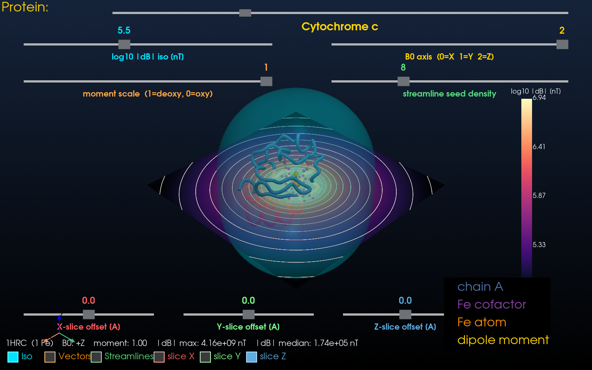

# Magnetic Field Around Iron-Containing Proteins — 3D Interactive Simulator

A scientifically grounded simulation and visualization of the magnetic field
produced by the paramagnetic iron centers in a curated library of
biologically iconic Fe-containing proteins. Select any protein from the
dropdown at the top of the GUI; the field is recomputed and the scene
re-rendered live.

This is the same physics that underlies **BOLD contrast in functional MRI**:
deoxyhemoglobin's Fe(II) is high-spin (S = 2, ~5.4 μB per Fe) and
paramagnetic, so it perturbs an external B₀ field. Oxyhemoglobin is
low-spin and effectively diamagnetic. The fMRI signal you've seen in
neuroscience papers tracks exactly the field perturbation we visualize here.

## Protein library

The top-of-window dropdown lets you switch between any of these proteins
live. PDB files are downloaded on first use and cached under `data/`.

| Display name | PDB | Fe count | Biological role |
|---|---|---|---|
| Hemoglobin (deoxy) | 2HHB | 4 (heme) | oxygen transport in blood — paramagnetic deoxy state, basis of BOLD fMRI |
| Hemoglobin (R-state) | 1A3N | 4 (heme) | alternative crystal form for comparing T ↔ R allostery |
| Myoglobin | 1MBN | 1 (heme) | oxygen storage in muscle — first protein ever solved by X-ray (Kendrew, 1958) |
| Cytochrome c | 1HRC | 1 (heme C) | mobile electron carrier in the mitochondrial respiratory chain |
| Cytochrome P450cam | 2CPP | 1 (heme) | archetype of the P450 superfamily — drug metabolism |
| Rubredoxin | 5RXN | 1 ([Fe-Cys₄]) | smallest known iron-sulfur protein (~6 kDa) |
| Ferredoxin [2Fe-2S] | 3FXC | 2 ([2Fe-2S] cluster) | photosynthetic electron transfer |
| Transferrin (N-lobe) | 1A8E | 1 (Fe(III)) | iron transport in blood |


*Default view: cyan **isosurface** of |ΔB|, magma-colored **Z-slice** with white **contour lines** of log₁₀ |ΔB|, and the four hemoglobin chains as colored ribbons. Each orange Fe carries a yellow induced-dipole arrow.*

<details>
<summary><b>More views</b> (click to expand)</summary>



*Cytochrome c selected from the dropdown — with a single Fe heme this is the canonical textbook **point-dipole far field**: a spherical isosurface and concentric circular contour rings.*

![Ferredoxin [2Fe-2S] selected from the dropdown - two nearby Fe atoms produce a slightly elongated isosurface and an interference pattern in the contour lines](docs/screenshot_ferredoxin.png)

*Ferredoxin's **[2Fe-2S] cluster** — two paramagnetic Fe atoms only ~2.7 Å apart produce a slightly elongated isosurface and an interference pattern in the contour lines.*


*Z-slice scanned to **+15 Å above the heme plane** of hemoglobin using the bottom-row slider — concentric contour rings appear around each Fe atom.*


*All three orthogonal contour planes turned on at the protein center — closed dipolar contour loops on each cross-section.*

</details>

## What the simulator does

1. Downloads the chosen PDB file from RCSB (cached in `data/`).
2. Extracts the iron atoms, the iron cofactors (heme variants HEM /
   HEC / HEA, [Fe-S] cluster residues FES / SF4 / F3S, bare Fe ions),
   and the C‑α backbone per chain.
3. Treats each Fe as a point magnetic dipole aligned with a user-chosen
   external field **B₀**. Each dipole carries a moment of
   `moment_scale × 5.4 μB` (1.0 = pure high-spin deoxy, 0.0 = fully
   diamagnetic).
4. Computes the total dipolar field

   $$ \Delta \mathbf{B}(\mathbf{r}) = \frac{\mu_0}{4\pi}\sum_i
      \frac{3(\mathbf{m}_i\cdot\hat{\mathbf{r}}_i)\hat{\mathbf{r}}_i - \mathbf{m}_i}{r_i^3} $$

   on a regular 3D grid whose extent **auto-adapts** to each protein's
   bounding box (clamped to a 20–60 Å radius so very small / very large
   proteins both render sensibly).
5. Renders the result interactively with PyVista: the protein as a
   colored ribbon, the iron cofactors, the Fe atoms with dipole arrows,
   and the field as a combination of **isosurface**, **streamlines**,
   **vector glyphs**, and **three independent cross-section contour
   plots** (one per X / Y / Z axis, each scannable along its normal).
6. Lets you switch between any protein in the library live via a
   top-of-window dropdown — the field grid, slice slider ranges,
   protein actors, and legend are all rebuilt transparently.

## Install

```bash
python3 -m venv .venv
source .venv/bin/activate
pip install -r requirements.txt
```

## Run

```bash
python run.py
```

On first launch the PDB file is downloaded automatically (≈530 kB) and
cached in `data/`.

### CLI options

```
python run.py --pdb 1MBN      # start with myoglobin instead of hemoglobin
python run.py --pdb 1HRC      # cytochrome c - clean single-dipole pattern
python run.py --grid-n 80     # finer 80**3 field grid (slower, prettier)
python run.py --extent 40     # force a fixed sampling box (in Angstroms);
                              # by default the grid auto-sizes per protein
```

You can also drop in any other PDB ID containing Fe — it doesn't have
to be one of the curated library entries, but in that case the dropdown
will only let you switch between the eight library proteins.

## Controls

**Protein selector** (top of window, gold "Protein:" label): drag the
dropdown slider to scroll through the curated library. The new
structure is downloaded if needed, the field grid is re-sized to fit,
all visualization layers are recomputed, and the camera is reset.

Top sliders (two rows):

- **log10 |ΔB| isosurface [nT]** — cyan isosurface threshold.
- **B₀ axis** (0=X, 1=Y, 2=Z) — direction of the external field that
  polarizes the Fe spins.
- **moment scale** — `1.0` = fully deoxy, `0.0` = fully oxy.
  Anywhere in between models partial oxygenation.
- **streamline seed density** — number of seed points used to trace the
  field lines.

Bottom row of sliders — **scan the cross-section contour planes**:

- **X-slice offset [Å]**, **Y-slice offset [Å]**, **Z-slice offset [Å]**
  — slide each slice plane along its normal, through the full grid.
  The range follows the protein's adaptive grid half-extent (≈ 28 Å
  for tiny proteins like rubredoxin, ≈ 60 Å for big ones like P450).
  Each slice is drawn as a filled magma cross-section *plus* white
  contour lines of log₁₀ |ΔB| — a proper contour plot of the
  magnetic-field magnitude.

Toggle buttons (bottom-left):

- **Iso** (cyan), **Vectors** (orange), **Streamlines** (green) — turn
  each visualization layer on/off.
- **slice X** (red), **slice Y** (green), **slice Z** (blue) — toggle
  each of the three orthogonal cross-section contour planes
  independently. Standard X-red / Y-green / Z-blue axis colors.

Live readout (lower-left) shows the current B₀ axis, moment scale, and
the max and median of |ΔB| in nano-Tesla.

## Files

```
.
├── run.py                    # entry point (CLI: --pdb, --grid-n, --extent)
├── requirements.txt
├── README.md
├── data/                     # PDB cache (auto-populated)
├── docs/                     # README screenshots
└── src/
    ├── __init__.py
    ├── pdb_loader.py         # download + minimal PDB parser + protein library
    ├── magnetic_field.py     # dipole-field solver on a 3D grid
    └── visualizer.py         # PyVista interactive GUI (dropdown, sliders, ...)
```

## Notes & caveats

* The point-dipole approximation is excellent in the far field (which is
  where ~all of the BOLD signal originates) but becomes inaccurate
  inside the heme plane itself. A short Plummer softening length keeps
  the field finite at the Fe atom for visualization purposes.
* The moments are taken as perfectly aligned with B₀ (Curie-law,
  small-B₀ regime). For realistic B₀ ≤ 10 T this is a very good
  approximation at body temperature for non-interacting high-spin Fe
  centers.
* **All Fe atoms share the same nominal moment (5.4 μB high-spin Fe(II))**
  across the whole library. This is quantitatively correct for
  deoxyhemoglobin and high-spin myoglobin / P450 / rubredoxin, but is
  an over-estimate for low-spin Fe (cytochrome c, S=1/2 → ~1.7 μB) and
  anti-ferromagnetically coupled clusters (oxidized [2Fe-2S], S=0 →
  ~0 μB). Use the **moment scale** slider to dial moments down by hand
  when you want to model these states. The *shape* of the dipole field
  (the focus of this simulator) is correct regardless.
* You can drop in any other PDB ID containing Fe via `--pdb` and it
  will load even if it's not in the curated dropdown.

## References

- L. Pauling & C. Coryell, *Proc. Natl. Acad. Sci.* 22, 210 (1936).
- M. Cerdonio et al., *Proc. Natl. Acad. Sci.* 74, 398 (1977).
- S. Ogawa et al., *Magn. Reson. Med.* 14, 68 (1990) — BOLD contrast.
- G. Fermi et al., *J. Mol. Biol.* 175, 159 (1984) — 2HHB structure.
